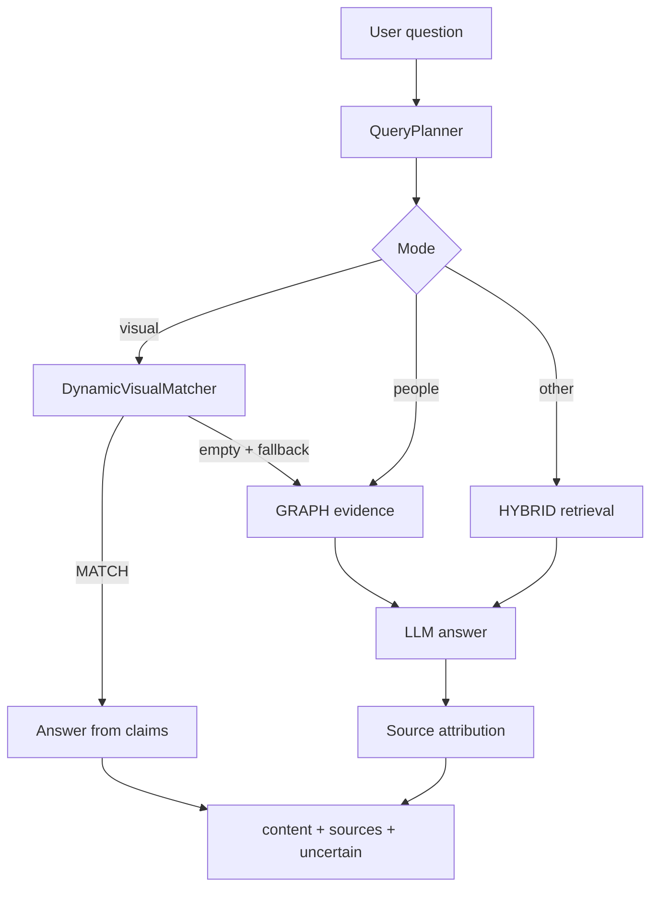

# RAG

Multi-user GraphRAG for a private photo and document library: hybrid retrieval (vector + lexical), a people/relations knowledge graph, and face identity.

Answers are short, grounded in **certain** evidence only. Sources are returned separately — no invented identities or details.

## Stack

- **Backend:** Java 17, Spring Boot, PostgreSQL + PGVector, JWT, Flyway, RabbitMQ, Redis
- **Frontend:** Next.js
- **Infra:** Docker Compose (`pgvector`, `rabbitmq`, `redis`, `face-service`)
- **LLM:** DeepInfra (control / answer / attribution / vision / embedding)

## Quick start

```bash
docker compose up -d

cd backend && ./mvnw spring-boot:run
# API: http://localhost:8080  ·  Swagger: /swagger-ui.html

cd frontend && npm install && npm run dev
# UI: http://localhost:3000
```

Set `DEEPINFRA_API_KEY` and a strong `JWT_SECRET` (see env table below). Do not commit `.env` files.

## Flows

### Inference



Routing is LLM-only (`QueryPlanner`). Attribution runs **after** the answer; if sources cannot be assigned reliably → `uncertain` and empty `sources`.

### Ingest


Disable the broker with `rag.ingest.async-enabled=false`.

## Auth

| Method | Path | Notes |
|--------|------|--------|
| POST | `/api/auth/register` | email, password (min 8) |
| POST | `/api/auth/login` | returns `accessToken` |
| GET | `/api/auth/me` | Bearer JWT |

All other `/api/**` routes require JWT. Resources are scoped by `ownerId`.

## Environment

| Variable | Default | Purpose |
|----------|---------|---------|
| `JWT_SECRET` | placeholder | HMAC secret — set in prod |
| `DB_URL` / `DB_USERNAME` / `DB_PASSWORD` | localhost:5433 | PostgreSQL |
| `DEEPINFRA_API_KEY` | — | LLM / vision |
| `FACE_SERVICE_URL` | `http://localhost:8001` | Face service |
| `RAG_INGEST_ASYNC` | `true` | Async ingest via RabbitMQ |
| `REDIS_HOST` / `REDIS_PORT` | localhost / 6379 | Rate limit + identity cache |
| `NEXT_PUBLIC_BACKEND_URL` | `http://localhost:8080` | Frontend API URL |

## Tests

```bash
cd backend && ./mvnw test
```
