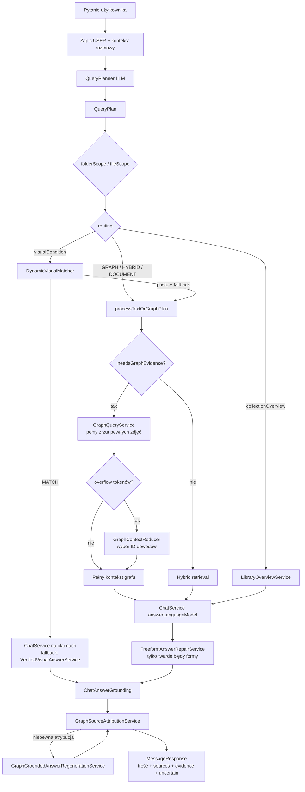
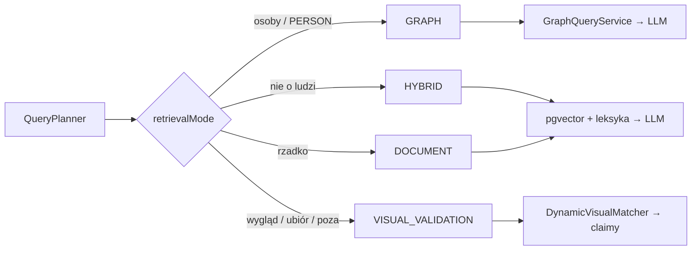
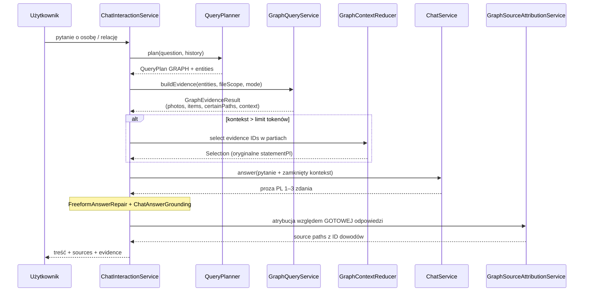
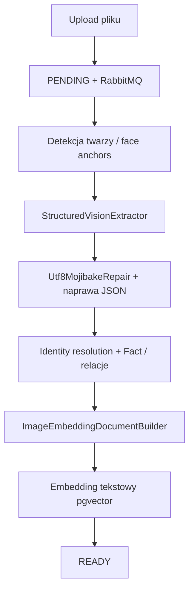

# Cogniface / RAG — multi-user GraphRAG

Spring Boot backend + Next.js frontend: prywatna biblioteka zdjęć i dokumentów z hybrid retrieval (wektor + leksyka), grafem wiedzy o ludziach oraz face identity.

**Sukces produktu:** krótka, naturalna odpowiedź po polsku (zwykle 1–3 zdania), oparta wyłącznie na **pewnych** dowodach — źródła osobno w `sources`, bez halucynacji tożsamości.

Zasady decyzyjne (kontrakt systemu): [`AGENTS.md`](AGENTS.md).  
Kontrakt UI: [`frontend/DESIGN.md`](frontend/DESIGN.md).

## Stack

- **Backend:** Java 17, Spring Boot 4, JPA, PostgreSQL + PGVector, Spring Security JWT, Flyway, RabbitMQ async ingest, Redis (rate limit + identity cache), Actuator, springdoc OpenAPI
- **Frontend:** Next.js, token Bearer w `localStorage`
- **Infra:** Docker Compose (`pgvector`, `rabbitmq`, `redis`, `face-service`)
- **LLM:** DeepInfra (osobne modele: control / answer / attribution / vision / embedding)

## Szybki start

### 1. Baza, RabbitMQ, Redis i face-service

```bash
docker compose up -d
```

RabbitMQ management UI: `http://localhost:15672` (guest/guest)  
Redis: `localhost:6379`  
Health: `http://localhost:8080/actuator/health` (public; components: db, redis, rabbit, faceService)

### 2. Backend

```bash
cd backend
# opcjonalnie: plik .env z DEEPINFRA_API_KEY, JWT_SECRET, DB_*
./mvnw spring-boot:run
```

API: `http://localhost:8080`  
Swagger UI: `http://localhost:8080/swagger-ui.html`  
OpenAPI JSON: `http://localhost:8080/v3/api-docs`

### 3. Frontend

```bash
cd frontend
npm install
npm run dev
```

UI: `http://localhost:3000` — najpierw **rejestracja / logowanie**.

---

## Pipeline inferencji (pytanie → odpowiedź)

Routing trybu retrieval jest **wyłącznie przez LLM `QueryPlanner`** (bez regexów / list fraz w kodzie aplikacji).  
Wejście HTTP: `POST /api/chat/{id}/send` → `ChatInteractionService`.

### Diagram: end-to-end inference



### Diagram: tryby `QueryPlan`



### Diagram: ścieżka GRAPH (ludzie)



### Etapy (klasy)

| Etap | Klasa | Wejście → wyjście |
|------|--------|-------------------|
| Orkiestracja | `ChatInteractionService` | `MessageRequest` → `MessageResponse` |
| Planowanie | `QueryPlanner` / `QueryPlan` | pytanie + historia → tryb, entities, scope, visualCondition |
| Polityka | `ChatRetrievalPolicy` | decyzje techniczne (graf? fallback? deny joint file?) |
| Dowody grafowe | `GraphQueryService` | entities/scope → `GraphEvidenceResult` (pełne pewne zdjęcia) |
| Redukcja | `GraphContextReducer` | overflow → wybór **istniejących** ID (bez streszczeń) |
| Odpowiedź | `ChatService` | zamknięty kontekst → proza PL |
| Repair formy | `FreeformAnswerRepairService` | tylko hard-failure shapes |
| Grounding | `ChatAnswerGrounding` | wycina eseje / odmowy „nie widzę” / spekulacje |
| Atrybucja | `GraphSourceAttributionService` | gotowa odpowiedź + ID dowodów → `sources` |
| Visual | `DynamicVisualMatcher`, `VerifiedVisualAnswerService` | warunek wizualny → MATCH claimy |
| Overview | `LibraryOverviewService` | inwentarz biblioteki (bez opisu treści zdjęć) |

### Pewne źródła

Do odpowiedzi i listy `sources` trafiają wyłącznie dowody **pewne**:

- decyzja wizualna `MATCH` powyżej progu,
- wzmianki `CONFIRMED` ≥ `rag.graph.min-mention-confidence`,
- fakty ≥ `rag.graph.min-fact-confidence`.

`certainPaths` opisuje pakiet grafowy — **nie** jest automatycznie listą źródeł odpowiedzi.  
`sources` powstają **po** wygenerowaniu odpowiedzi, przez atrybucję do konkretnych identyfikatorów dowodów.  
Przy niepewnej atrybucji: `uncertain=true` i puste `sources` (zamiast złego zdjęcia).

### Role modeli LLM

| Bean | Rola |
|------|------|
| `structuredControlLanguageModel` | QueryPlanner, GraphContextReducer, visual context-match |
| `answerLanguageModel` | ChatService, FreeformAnswerRepair, regeneracja |
| `attributionLanguageModel` | GraphSourceAttributionService |
| `visionModel` | weryfikacja pikseli w DynamicVisualMatcher |

### Klucze latency / inference

| Klucz | Dom. | Znaczenie |
|-------|------|-----------|
| `llm.timeout-seconds` | 90 | budżet czasu planner + answer |
| `llm.deepinfra.control-model` | = chat | szybszy model control |
| `llm.deepinfra.answer-model` | = chat | jakość odpowiedzi |
| `llm.deepinfra.attribution-model` | = answer | atrybucja źródeł |
| `llm.control.max-tokens` | 512 | planer / reducer |
| `llm.answer.max-tokens` | 768 | odpowiedź |
| `llm.answer.context-window-tokens` | 32768 | budżet reducera |
| `rag.graph.reducer.max-input-tokens` | 8192 | partie reducera |
| `rag.graph.attribution.lexical-min-score` | 0.18 | fallback leksykalny atrybucji |
| `rag.visual-match.max-vision-analyses` | 20 | limit kosztownych wywołań VL |

Profil wydajnościowy: `application-perf.properties` (`--spring.profiles.active=perf`).

---

## Pipeline ingestu (obraz → graf + embedding)



1. `POST /api/folders/{id}/upload` → status **`PENDING`**, event RabbitMQ → **HTTP 202**.
2. Worker: vision / embeddingi / face → **`READY`** lub **`FAILED`**.
3. Poll: `GET /api/data/files/ingestion-status?path=…`
4. Vision **nie zgaduje imion** (`person 1`); imiona z tagów, face-match, identity resolution.
5. Kanoniczny dokument embeddingu: wyłącznie `ImageEmbeddingDocumentBuilder`.

Kolejka: `rag.ingest.document-uploaded` (+ DLQ, retry 3×).  
Bez brokera: `rag.ingest.async-enabled=false`.

---

## Auth (JWT)

Publiczne:

| Method | Path | Opis |
|--------|------|------|
| POST | `/api/auth/register` | email, password (min 8), displayName? |
| POST | `/api/auth/login` | → `accessToken` + `user` |
| GET | `/api/auth/me` | wymaga `Authorization: Bearer …` |

Pozostałe `/api/**` wymagają Bearer JWT. Zasoby (foldery, czaty, pliki) są izolowane po `ownerId`.

### curl

```bash
# rejestracja
curl -s -X POST http://localhost:8080/api/auth/register \
  -H "Content-Type: application/json" \
  -d "{\"email\":\"demo@example.com\",\"password\":\"password123\",\"displayName\":\"Demo\"}"

# logowanie
TOKEN=$(curl -s -X POST http://localhost:8080/api/auth/login \
  -H "Content-Type: application/json" \
  -d "{\"email\":\"demo@example.com\",\"password\":\"password123\"}" \
  | jq -r .accessToken)

# przykładowe API
curl -s http://localhost:8080/api/folders -H "Authorization: Bearer $TOKEN"
```

W Swagger UI: **Authorize** → wklej sam token (UI dokłada `Bearer`).

## Zmienne środowiskowe

| Zmienna | Domyślnie | Opis |
|---------|-----------|------|
| `JWT_SECRET` | placeholder (min 32 znaki) | Sekret HMAC JWT — **ustaw w prod** |
| `JWT_EXPIRATION_MINUTES` | `10080` (7 dni) | Ważność access tokenu |
| `CORS_ALLOWED_ORIGINS` | `http://localhost:3000,...` | Origin frontendu |
| `DB_URL` / `DB_USERNAME` / `DB_PASSWORD` | localhost:5433 / user / password | PostgreSQL |
| `DEEPINFRA_API_KEY` | — | LLM / vision |
| `LLM_CONTROL_MODEL` / `LLM_ANSWER_MODEL` / `LLM_ATTRIBUTION_MODEL` | = chat-model | Rozdział modeli inference |
| `LLM_TIMEOUT_SECONDS` | `90` | Timeout LLM (control/answer) |
| `FACE_SERVICE_URL` | `http://localhost:8001` | Serwis twarzy |
| `RAG_INGEST_ASYNC` | `true` | `false` = synchroniczny ingest bez RabbitMQ |
| `RABBITMQ_HOST` / `PORT` / `USER` / `PASSWORD` | localhost:5672 guest | Broker ingestu |
| `REDIS_HOST` / `REDIS_PORT` | localhost / 6379 | Rate limit + identity cache |
| `RATE_LIMIT_ENABLED` | `true` | Rate limit na chat send i upload |
| `RATE_LIMIT_CHAT_SEND` / `RATE_LIMIT_UPLOAD` | 30 / 20 per window | Limity żądań |
| `RATE_LIMIT_FAIL_OPEN` | `true` | Gdy Redis down — przepuszczaj (dev) |
| `IDENTITY_CACHE_ENABLED` | `true` | Cache wyników face identity match |
| `IDENTITY_CACHE_TTL_SECONDS` | `300` | TTL cache identity |
| `NEXT_PUBLIC_BACKEND_URL` | `http://localhost:8080` | URL API dla frontu |

**Nie commituj** `.env`, kluczy API ani haseł produkcyjnych.

## Redis, rate limit i health

- **Rate limit (Redis fixed window):** `POST /api/chat/{id}/send` oraz `POST /api/folders/{id}/upload` → przy przekroczeniu **HTTP 429**.
- **Identity cache:** wyniki face match w Redis (TTL konfigurowalny).
- **Health:** `GET /actuator/health` — DB, Redis, RabbitMQ, face-service (public).

## Flyway

Migracje w `backend/src/main/resources/db/migration/` (auth/ownership, statusy ingestu, indeksy grafu, face-anchored claims).  
`spring.flyway.baseline-on-migrate=true` — bezpieczne na istniejących bazach.

## Testy

```bash
cd backend
./mvnw test
```

M.in.: JWT, izolacja folderów, QueryPlanner, GraphQueryService, GraphContextReducer, GraphSourceAttributionService, grounding.

## Mapowanie kodu

| Obszar | Główne miejsca |
|--------|----------------|
| Planer | `QueryPlanner`, `QueryPlan` |
| Orkiestracja | `ChatInteractionService`, `ChatRetrievalPolicy` |
| Graf | `GraphQueryService`, `GraphEvidenceItem`, `GraphPhotoEvidence` |
| Redukcja | `GraphContextReducer` |
| Atrybucja | `GraphSourceAttributionService` |
| Visual | `DynamicVisualMatcher`, `VerifiedVisualAnswerService` |
| Hybrid | `LexicalEmbeddingSearch`, `ImageCandidateRetriever` |
| Ingest / vision | `StructuredVisionExtractor`, `IngestionService` |
| Embedding zdjęcia | `ImageEmbeddingDocumentBuilder` |
| Odpowiedź PL | `ChatService.ANSWER_INSTRUCTIONS` |
