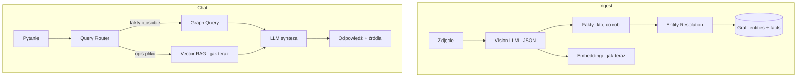

# Plan budowy: hybrydowy RAG + graf encji (GraphRAG-lite)

Plan dopasowany do stacku: **Spring Boot + LangChain4j + pgvector + PostgreSQL + Next.js**.

**Cel:** po wrzuceniu zdjęć postaci A (np. jedzącej zupę i grającej w piłkę) zadać pytanie *„jakie czynności robi postać A?”* i otrzymać odpowiedź ze **wszystkich** powiązanych obrazów — z obsługą podobnych osób i ręcznego potwierdzenia tożsamości.

---

## Architektura docelowa



**Zasada:** vector RAG zostaje do pytań o treść pojedynczego dokumentu; graf obsługuje pytania o **osobę / encję przez wiele plików**.

---

## Stan obecny (punkt wyjścia)

| Element | Jak działa teraz |
|---------|------------------|
| Ingest obrazów | Vision LLM → jeden luźny opis tekstowy |
| Storage | pgvector (`embeddings`) + metadata: `path`, `filename`, `document_id` |
| Retrieval | Vector search top-40 → LLM rerank → top-5 |
| Encje / graf | Brak |
| Tożsamość między zdjęciami | Brak |

**Główne ograniczenie:** pytanie „co robi postać A we wszystkich zdjęciach?” wymaga agregacji po encji, a nie tylko podobieństwa wektorowego.

---

## Faza 0 — Zakres MVP (1–2 dni)

### W scope

- Ekstrakcja strukturalna z obrazów: `postacie`, `czynności`, `obiekty`
- Graf faktów w PostgreSQL (bez Neo4j na start)
- Łączenie tożsamości z **pewnością** (score)
- Ręczny tag/alias przy uploadzie (opcjonalny)
- UI: potwierdzenie „czy to ta sama osoba?”
- Router zapytań w czacie (prosty klasyfikator)
- Odpowiedzi z cytowaniem plików źródłowych

### Poza scope (v2)

- Pełny Microsoft GraphRAG (community detection, hierarchical summaries)
- Face recognition / re-ID na embeddingach twarzy
- Graf relacji między wieloma typami encji (miejsca, organizacje)

### Kryteria sukcesu (testy akceptacyjne)

1. 2 zdjęcia tej samej postaci (z tagiem „A”) → pytanie o czynności A → obie aktywności
2. 2 podobne osoby bez tagu → system **nie łączy** automatycznie albo pyta o potwierdzenie
3. Pytanie o jeden plik → nadal działa obecny vector RAG
4. Usunięcie pliku → fakty i powiązania znikają

---

## Faza 1 — Model danych (2–3 dni)

### Nowe tabele PostgreSQL

```sql
-- Kanoniczna encja (postać, osoba)
CREATE TABLE entities (
  id UUID PRIMARY KEY,
  display_name VARCHAR NOT NULL,
  type VARCHAR NOT NULL DEFAULT 'PERSON',
  created_at TIMESTAMP NOT NULL,
  updated_at TIMESTAMP NOT NULL
);

-- Aliasy użytkownika / systemu
CREATE TABLE entity_aliases (
  id UUID PRIMARY KEY,
  entity_id UUID NOT NULL REFERENCES entities(id) ON DELETE CASCADE,
  alias VARCHAR NOT NULL,
  source VARCHAR NOT NULL DEFAULT 'USER'  -- USER | AUTO
);

-- Wykryta osoba na konkretnym zdjęciu (instancja)
CREATE TABLE entity_mentions (
  id UUID PRIMARY KEY,
  entity_id UUID REFERENCES entities(id) ON DELETE SET NULL,
  file_path VARCHAR NOT NULL,
  label VARCHAR NOT NULL,
  confidence DECIMAL(4,3) NOT NULL,
  status VARCHAR NOT NULL DEFAULT 'SUGGESTED',  -- CONFIRMED | SUGGESTED | REJECTED | PENDING
  visual_cues JSONB,
  created_at TIMESTAMP NOT NULL
);

-- Fakt: kto co robi
CREATE TABLE facts (
  id UUID PRIMARY KEY,
  mention_id UUID NOT NULL REFERENCES entity_mentions(id) ON DELETE CASCADE,
  action VARCHAR NOT NULL,
  object VARCHAR,
  file_path VARCHAR NOT NULL,
  confidence DECIMAL(4,3) NOT NULL,
  created_at TIMESTAMP NOT NULL
);

-- Propozycje łączenia dwóch mentions (podobne osoby)
CREATE TABLE identity_suggestions (
  id UUID PRIMARY KEY,
  mention_id_a UUID NOT NULL REFERENCES entity_mentions(id) ON DELETE CASCADE,
  mention_id_b UUID NOT NULL REFERENCES entity_mentions(id) ON DELETE CASCADE,
  similarity_score DECIMAL(4,3) NOT NULL,
  status VARCHAR NOT NULL DEFAULT 'PENDING'  -- PENDING | MERGED | REJECTED
);
```

### Backend — nowy pakiet

```
backend/src/main/java/com/rag/rag/knowledge/
  entity/
    Entity.java
    EntityAlias.java
    EntityMention.java
  fact/
    Fact.java
  identity/
    IdentitySuggestion.java
    IdentityResolutionService.java
  graph/
    GraphQueryService.java
  extraction/
    StructuredVisionExtractor.java
  repository/
    EntityRepository.java
    EntityMentionRepository.java
    FactRepository.java
    IdentitySuggestionRepository.java
```

### Rozszerzenie `FileEntity`

- `entityTag` — opcjonalny tag z uploadu (np. „A”)
- `ingestionStatus` — `PENDING | EXTRACTED | NEEDS_REVIEW | READY`

---

## Faza 2 — Structured extraction przy ingestcie (3–4 dni)

### Zmiana w `IngestionService.processImage()`

**Obecnie:** jeden luźny opis tekstowy.

**Docelowo:** dwa kroki:

1. Vision → JSON (structured prompt)
2. JSON → graf + tekst do embeddingów

### Przykładowy prompt vision (oczekiwany JSON)

```json
{
  "people": [
    {
      "label": "mężczyzna w czerwonej koszulce",
      "actions": ["je zupę"],
      "objects": ["zupa", "łyżka"],
      "visual_cues": ["czerwona koszulka", "krótkie włosy"]
    }
  ],
  "scene": "kuchnia"
}
```

### Nowa klasa: `StructuredVisionExtractor`

- Wywołuje `visionModel` z promptem wymuszającym JSON
- Walidacja schematu (Jackson / JSON Schema)
- Fallback: jeśli JSON się nie parsuje → stary tryb (plain text) + status `NEEDS_REVIEW`

### Pipeline ingest (po uploadzie pliku)

```
1. Zapis FileEntity (jak teraz)
2. StructuredVisionExtractor.extract(image)
3. Dla każdej osoby w JSON:
   a. Utwórz EntityMention (status SUGGESTED)
   b. Utwórz Fact(y) powiązane z mention
4. IdentityResolutionService.resolve(mention)
   - jeśli file.entityTag != null → przypisz do Entity("A")
   - else szukaj podobnych mentions (Faza 3)
5. Tekst kanoniczny do embeddingów:
   "Postać: A. Czynność: je zupę. Scena: kuchnia. Plik: zupa.jpg"
6. EmbeddingStoreIngestor (jak teraz) + metadata:
   path, filename, mention_ids[], entity_ids[]
```

### Pliki do edycji

- `backend/src/main/java/com/rag/rag/ingestion/service/IngestionService.java`
- `backend/src/main/resources/application.properties` — `vision.structured.prompt`, progi pewności
- `backend/src/main/java/com/rag/rag/core/config/EmbeddingConfiguration.java` — bogatsze metadata

---

## Faza 3 — Rozpoznawanie tożsamości (3–5 dni)

Najtrudniejsza część — osobno od GraphRAG.

### Strategia warstwowa

| Warstwa | Logika | Kiedy |
|---------|--------|-------|
| **L1: Tag użytkownika** | `entityTag="A"` przy uploadzie → od razu `CONFIRMED` | Zawsze, jeśli podany |
| **L2: Alias folderu** | Folder `Postać_A` → domyślny alias | Opcjonalnie |
| **L3: Dopasowanie opisów** | Porównaj `label` + `visual_cues` między mentions (LLM lub fuzzy) | Automat |
| **L4: Potwierdzenie UI** | `identity_suggestions` ze score < 0.85 | Podobne osoby |

### `IdentityResolutionService` — pseudokod

```java
resolve(EntityMention mention):
  if (mention ma tag użytkownika) → link do Entity, CONFIRMED
  candidates = findSimilarMentions(mention)
  if (bestScore >= 0.85) → auto-merge do tej samej Entity
  if (0.60 <= bestScore < 0.85) → utwórz IdentitySuggestion, status PENDING
  else → nowa Entity, SUGGESTED
```

### Dopasowanie podobnych opisów (L3)

- **MVP:** LLM jako matcher — „Czy osoba A i osoba B to ta sama osoba? JSON: `{same: bool, confidence: 0-1}`”
- **v2:** embedding opisu postaci lub face recognition

### API tożsamości

```
GET  /api/knowledge/review/pending
POST /api/knowledge/mentions/{id}/confirm?entityId=...
POST /api/knowledge/mentions/{id}/reject
POST /api/knowledge/suggestions/{id}/merge
POST /api/knowledge/suggestions/{id}/split
POST /api/knowledge/entities
POST /api/knowledge/entities/{id}/aliases
```

---

## Faza 4 — Graph Query Service (2–3 dni)

### `GraphQueryService` — typy zapytań

```java
List<Fact> getActivitiesForEntity(String entityNameOrAlias);
List<Fact> getFactsForEntityInFiles(UUID entityId, List<String> paths);
Optional<Entity> resolveEntityByAlias(String name);
String buildContextForQuestion(String question);
```

### Przykładowe SQL

```sql
SELECT f.action, f.object, f.file_path, em.confidence
FROM facts f
JOIN entity_mentions em ON f.mention_id = em.id
JOIN entities e ON em.entity_id = e.id
LEFT JOIN entity_aliases ea ON ea.entity_id = e.id
WHERE (e.display_name ILIKE :name OR ea.alias ILIKE :name)
  AND em.status IN ('CONFIRMED', 'SUGGESTED')
ORDER BY f.created_at;
```

### Format kontekstu dla LLM (z grafu)

```
[Fakty z grafu wiedzy]
- Postać: A (pewność: 95%) | je zupę | plik: zupa.jpg
- Postać: A (pewność: 91%) | gra w piłkę | plik: pilka.jpg

[Niepewne powiązania]
- Osoba ze zdjęcia trening.jpg może być tą samą postacią (pewność: 72%) — nie uwzględniono
```

---

## Faza 5 — Router zapytań w czacie (2–3 dni)

### `QueryRouter` — klasyfikacja

| Typ | Przykład | Źródło |
|-----|----------|--------|
| `ENTITY_ACTIVITY` | „co robi postać A?” | Graf |
| `ENTITY_LIST` | „na których zdjęciach jest A?” | Graf |
| `DOCUMENT` | „co jest na zdjęciu zupa.jpg?” | Vector RAG |
| `HYBRID` | „co robi A w folderze Wakacje?” | Graf + filtr path |

### Heurystyki (bez LLM)

- Wzorzec: `/(co robi|jakie czynności|co robił|czym się zajmuje).*(postać|osoba)/i`
- Dopasowanie do `entity_aliases`

### Zmiana w flow czatu

```
processChatMessage():
  route = queryRouter.classify(question)

  switch (route):
    ENTITY_* → graphContext = graphQueryService.buildContext(question)
    DOCUMENT → obecny contentRetriever
    HYBRID   → oba

  prompt = mergeContexts(graphContext, vectorContext, question)
  answer = chatModel.generate(prompt)
```

### Pliki do edycji

- `backend/src/main/java/com/rag/rag/chat/service/ChatInteractionService.java`
- `backend/src/main/java/com/rag/rag/core/config/RetrievalConfiguration.java`
- `backend/src/main/java/com/rag/rag/chat/service/ChatService.java` — system prompt

### Zasady odpowiedzi LLM

- Rozróżniaj fakty z grafu (pewne) vs fragmenty dokumentów
- Jeśli tożsamość niepewna → powiedz wprost, nie zgaduj

---

## Faza 6 — Frontend (3–4 dni)

### 6a. Upload z opcjonalnym tagiem encji

W `frontend/app/folders/[id]/page.tsx`:

- pole opcjonalne: **„Postać / tag (np. A)”**
- API: `POST /api/folders/{id}/upload?entityTag=A`

### 6b. Panel wiedzy / przegląd tożsamości

- **Oczekujące potwierdzenia** — pary podobnych osób ze zdjęć
- przyciski: *Ta sama osoba* / *Różne osoby* / *Przypisz do „A”*

### 6c. Widok encji

`/knowledge/entities` lub panel w folderze:

- lista encji (A, B, …)
- pod każdą: zdjęcia + wykryte czynności
- edycja aliasów

### 6d. Czat — lepsze źródła

- Źródło typu `GRAPH_FACT` obok `IMAGE` / `PDF`
- przy niskiej pewności: banner „Odpowiedź może być niepełna”

### Nowe pliki frontend

```
frontend/lib/knowledge-api.ts
frontend/components/knowledge/IdentityReviewPanel.tsx
frontend/components/knowledge/EntityTagInput.tsx
frontend/app/knowledge/page.tsx          (opcjonalnie)
```

---

## Faza 7 — Testy i jakość (2 dni)

### Testy jednostkowe (backend)

- `StructuredVisionExtractor` — parsowanie JSON, fallback
- `IdentityResolutionService` — progi 0.85 / 0.60
- `GraphQueryService` — agregacja czynności
- `QueryRouter` — klasyfikacja pytań

### Scenariusze E2E

1. **Happy path:** 2 zdjęcia + tag „A” → pytanie → 2 czynności
2. **Bez tagu, spójne opisy:** auto-merge
3. **Podobne osoby:** suggestion PENDING, odpowiedź bez zgadywania
4. **Rename/move pliku:** fakty nadal pod właściwym path
5. **Delete pliku:** cascade delete mentions + facts

---

## Harmonogram

| Faza | Czas | Zależności |
|------|------|------------|
| 0 Zakres | 1–2 dni | — |
| 1 Model danych | 2–3 dni | 0 |
| 2 Structured extraction | 3–4 dni | 1 |
| 3 Identity resolution | 3–5 dni | 2 |
| 4 Graph query | 2–3 dni | 1, 2 |
| 5 Chat router | 2–3 dni | 4 |
| 6 Frontend | 3–4 dni | 3, 5 |
| 7 Testy | 2 dni | 6 |

**Razem: ~3–4 tygodnie** (1 dev, bez face recognition).

### Kolejność tygodniowa

```
Tydzień 1:  Faza 1 + Faza 2 (tabele + JSON z vision + zapis faktów)
Tydzień 2:  Faza 3 L1/L2 (tag ręczny) + Faza 4 (graph query) + test API
Tydzień 3:  Faza 5 (router w czacie) + Faza 6a/6b (tag + panel potwierdzeń)
Tydzień 4:  Faza 3 L3/L4 (auto-merge + sugestie) + testy + polish
```

**Szybki win po 1 tygodniu:** tag „A” przy uploadzie + fakty z JSON + zapytanie do grafu przez REST (bez pełnego czatu).

---

## Ryzyka i mitigacje

| Ryzyko | Mitygacja |
|--------|-----------|
| Vision zwraca zły JSON | Schema + retry + fallback na plain text |
| Mylenie podobnych osób | Próg auto-merge 0.85, poniżej → UI review |
| Koszt LLM (matcher) | Matcher tylko dla nowych mentions, cache wyników |
| Spójność przy rename pliku | Aktualizacja `file_path` w facts/mentions |
| Over-engineering | Bez Neo4j — tabele relacyjne w PostgreSQL |

---

## Tożsamość: automat vs ręcznie

| Element | Automatycznie? | Uwagi |
|---------|----------------|-------|
| Czynności (je zupę, gra w piłkę) | Tak | Z JSON vision |
| Ta sama osoba na 2 zdjęciach | Częściowo | Wymaga spójnych opisów lub tagu |
| Nazwa „A” | Zwykle ręcznie raz | Tag przy uploadzie lub alias |
| Podobne osoby | Ryzyko błędu | Poniżej 0.85 → potwierdzenie w UI |

---

## v2 (po MVP)

- Face embedding / re-ID dla zdjęć z twarzą
- Community summaries (prawdziwy GraphRAG) przy >100 obrazach
- Bounding box + crop postaci (powrót do idei detekcji ROI)
- Graf relacji: `A → znajomy → B`, `A → w → miejscu X`
- Wizualizacja grafu w UI

---

## Powiązane pliki w repozytorium

| Obszar | Plik |
|--------|------|
| Ingest obrazów | `backend/src/main/java/com/rag/rag/ingestion/service/IngestionService.java` |
| Retrieval | `backend/src/main/java/com/rag/rag/core/config/RetrievalConfiguration.java` |
| Rerank | `backend/src/main/java/com/rag/rag/core/rerank/LlmDocumentReranker.java` |
| Czat | `backend/src/main/java/com/rag/rag/chat/service/ChatInteractionService.java` |
| Upload UI | `frontend/app/folders/[id]/page.tsx` |
| API frontend | `frontend/lib/api.ts` |
